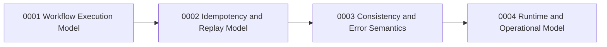

# ADRs

This directory captures architecture decisions for AtomicFlow.

## Scope
- Decision window: latest implementation phase on the current branch.
- Organization principle: concept-first decisions, with implementation notes as supporting evidence.

## Concept Map
1. [0001 Workflow Execution Model](0001-workflow-execution-model.md)
2. [0002 Idempotency and Replay Model](0002-idempotency-and-replay-model.md)
3. [0003 Consistency and Error Semantics](0003-consistency-and-error-semantics.md)
4. [0004 Runtime and Operational Model](0004-runtime-and-operational-model.md)

## How to Read
- Read in order: each ADR builds on invariants from the previous one.
- Each ADR has a "Changes in This Phase" section to connect concept decisions to concrete implementation work.

## Decision Relationships
- 0001 defines execution scope and lifecycle invariants.
- 0002 defines replay and idempotency semantics on top of 0001.
- 0003 defines consistency/error semantics across execution + replay.
- 0004 defines backend and operational behavior that implements 0001-0003.

## API Maturity Assessment (2026-03-06)
- API direction is coherent and substantially improved after scope-binding.
- Core concepts are now explicit: execution scope, replay identity, strict conflict semantics, and runtime portability.
- Deferred work remains: strict TTL enforcement semantics, compensation support, and README DSL alignment.
- Assessment: suitable for continued development, not yet stable/final API.
