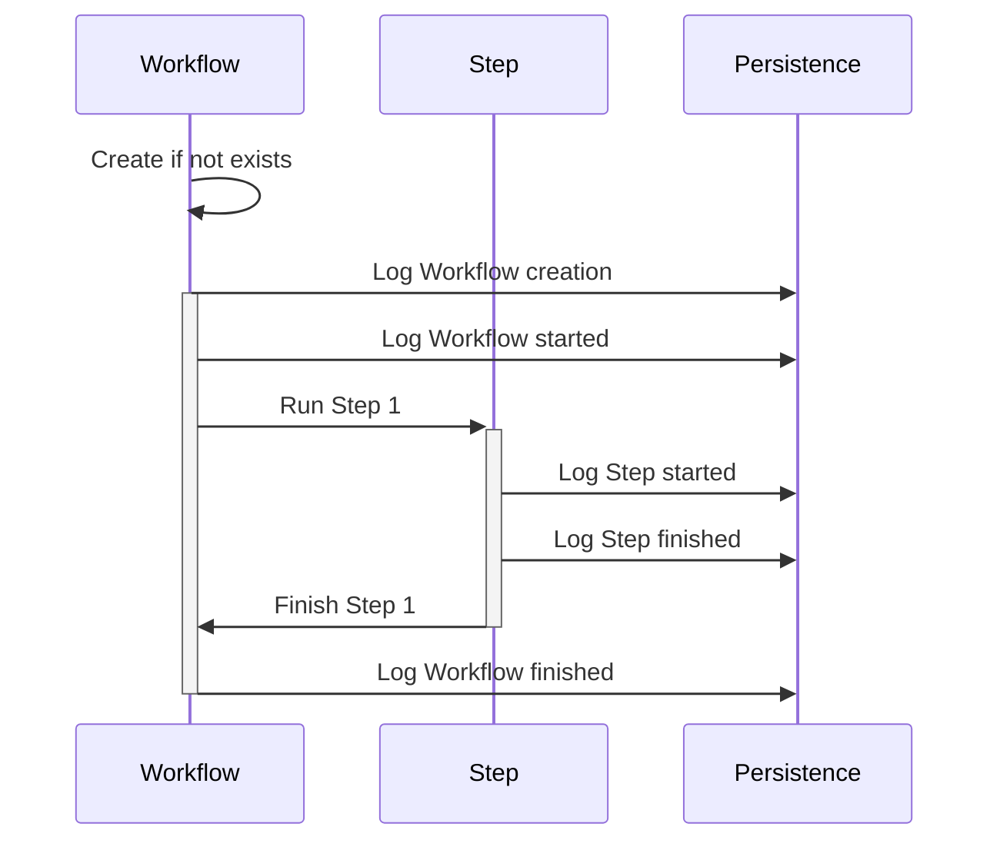

# Workflow Lifecycle

- create workflow instance
  - create workflow instance if not exists
  - throw if inputs to a workflow instance id changed
- recover workflow instance
  - lock workflow instance
  - log workflow start (TODO: should we log start attempt before locking?)
  - run steps
  - log workflow finish
  - unlock workflow instance

# Step Lifecycle

## Simple

- log step start
- log step finish?

## Cached

- log step start
- acquire step idempotency id by step meta and inputs
- load from cache by step meta, step idempotency id and inputs. cache would throw if inputs to a step idempotency id would change, but this can never happen
- log step finish

## OnlyOnce

- xa
  - log step start
  - check if step is in unknown state
  - acquire step idempotency id by step meta
- load from cache by step meta, step idempotency id and inputs. cache will throw if inputs to a step idempotency id change
- xa
  - set clean step state
  - log step finish

